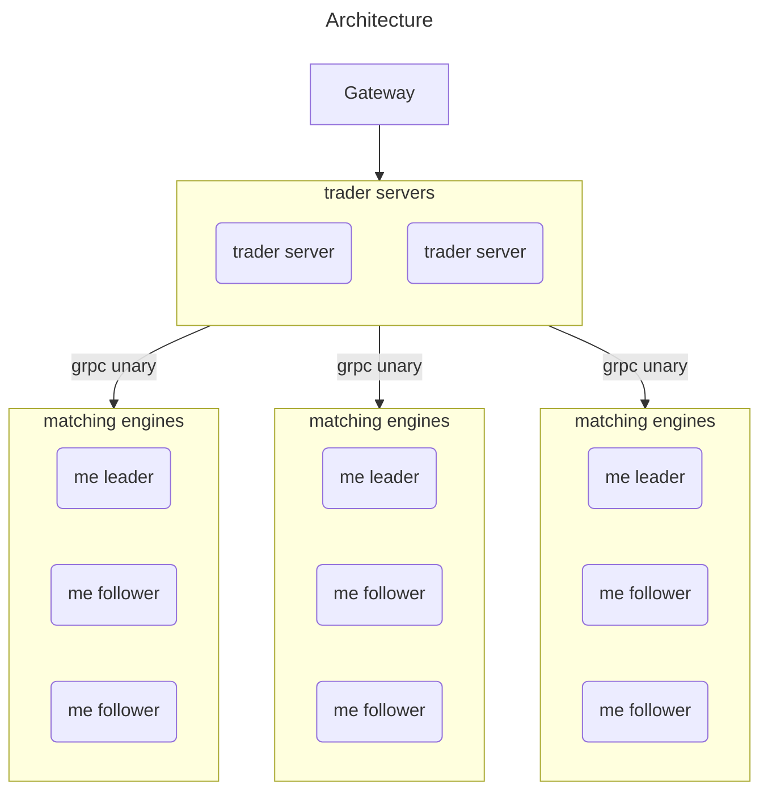

# mome

mome matches incoming buy/sell orders to create trade.

## Currently supported

- order types
    - market order — execute an order as fast as possible, cross the spread.
    - limit order - execute an order with a limit on bid/ask prices.
- order params
    - STOP - stop order, set a stop price which will activate the order once the market price crosses it
    - FOK - filled or killed, immediately match an order in full (without partial fills) or cancel it.
    - AON - all or nothing, don't allow partial fills
    - IOC - immediate or cancel, immediately fill what's possible, cancel the rest

## How order matching?

Market orders are always given priority above all other orders, then sorted according to time of arrival.

- orders are FIFO
    - bids - price (descending), time (ascending)
    - asks - price (ascending), time (ascending)
    - market price is set at the last trade price

## TODO

* [ ] raft recovery implement
* [ ] trade info sends to MessageQueue

## Architecture

### Gateway

The gateway receives all frontend requests and aggregates the necessary business logic.

### Trader server

The trader server determines the routing for the 'me-cluster,' manages its state, conducts asset verification, and
calculates transaction fees.

### Matching engine cluster

Splitting the engine into different groups based on stock symbol, each 'me cluster' handles a specific trading volume.
Designing the 'me cluster' to use Raft for maintaining data consistency within the cluster.

"me-cluster" uses a data structure based on RBTree for the matching process.
The average Big O of RBTree is O(log N),
allowing for fast insertion and deletion of data, making it well-suited for matching scenarios."

With the adoption of this solution, the recovery mechanism becomes crucial.

Utilizing the Raft protocol to maintain the state of machines ensures consistency of data across all nodes. In the event
of a leader failure, we can swiftly transition to another node to uphold service stability. Redis or PostgreSQL serve as
the ultimate means for backing up data, as their speed surpasses that of maintaining data directly on the node.